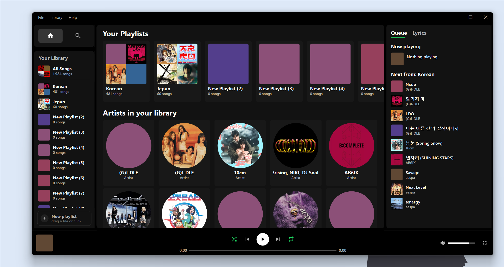
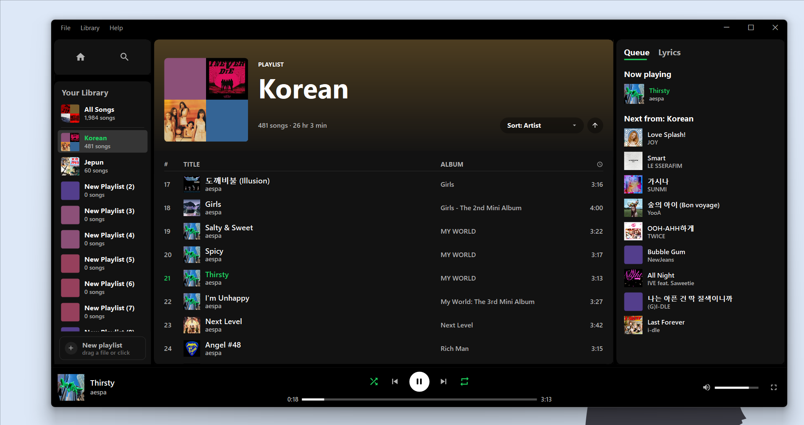
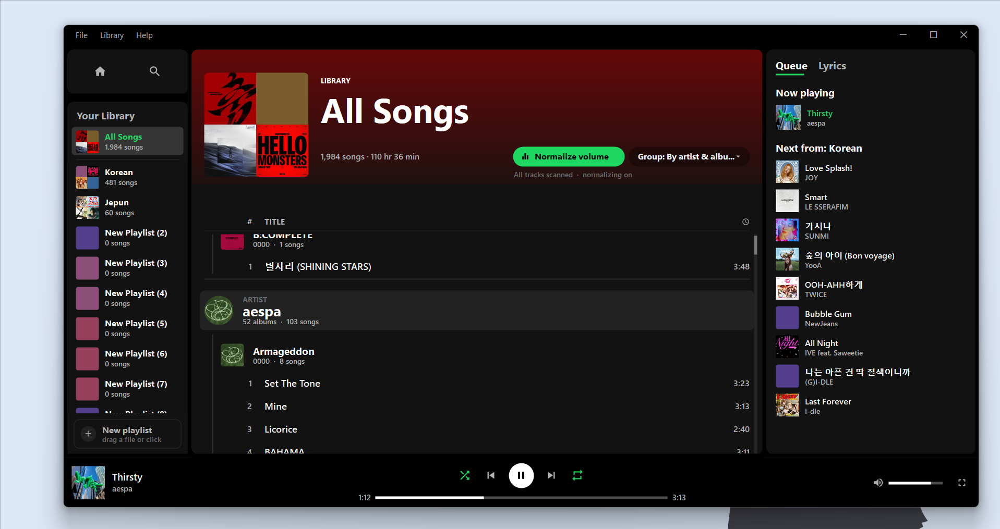
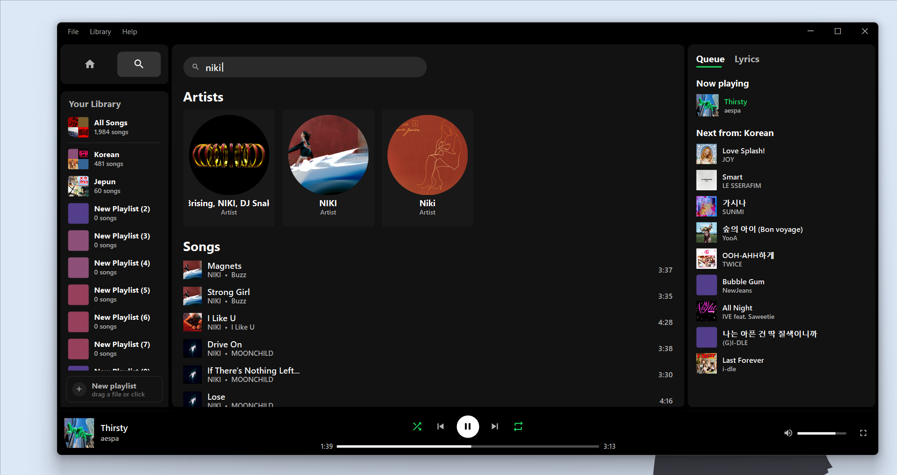
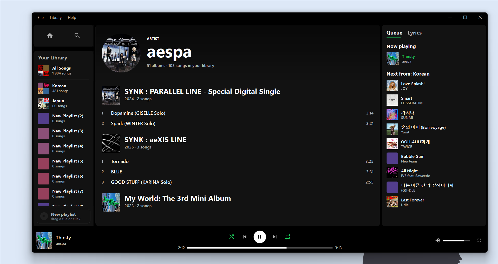
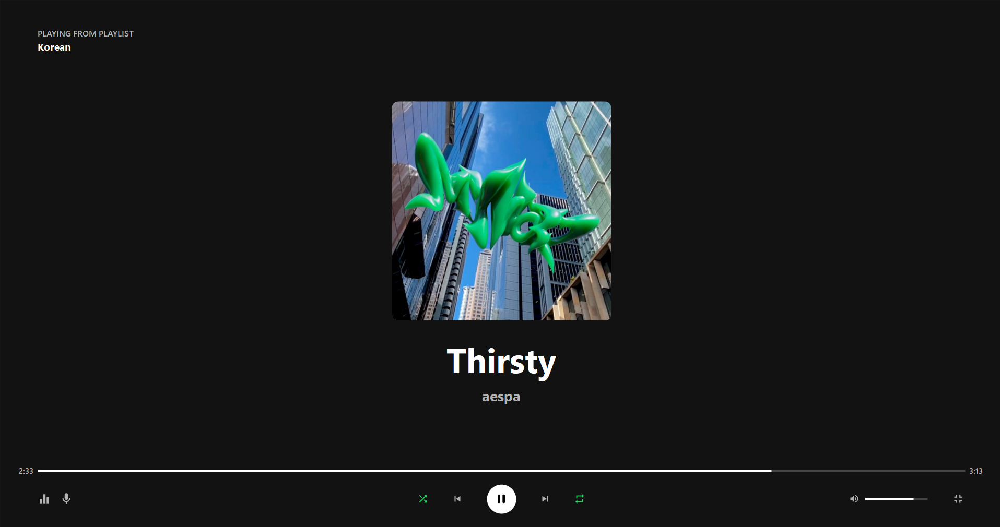
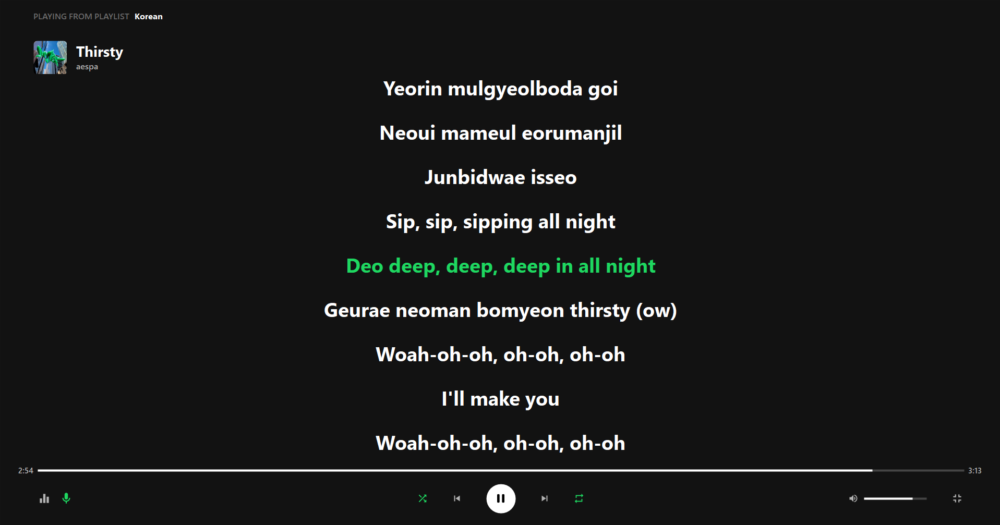
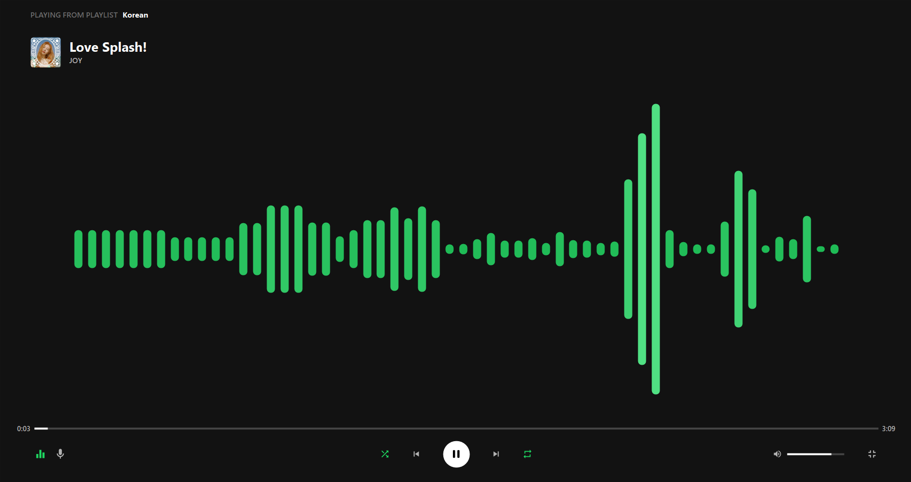
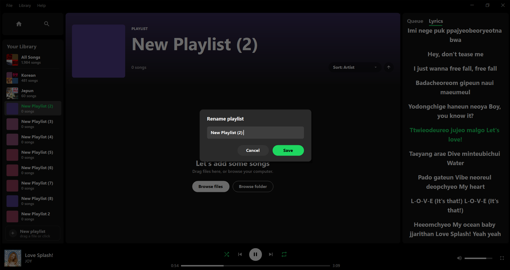

<div align="center">

# Verdant

### A modern Spotify-style theme for foobar2000

[](https://github.com/superziper/verdant-foobar2000-theme/releases/latest)
[](https://github.com/superziper/verdant-foobar2000-theme/releases)


**Four-step install. No components to hunt down. No fonts to install.**



</div>

---

Verdant restyles your **local** library and playlists into something that looks like a modern
streaming app. Everything on screen is custom-drawn in a [JSplitter](https://hydrogenaud.io/)
panel — sidebar, home, playlist and All Songs views, search, queue and lyrics pane, player bar,
fullscreen mode, even the window title bar. No stock foobar widgets are involved.

It does **not** connect to Spotify's service and plays nothing you don't already own.

---

## Screenshots

<table>
<tr>
<td width="50%"><br><sub><b>Playlist</b> — header tinted from the cover art, sortable tracks, live now-playing row</sub></td>
<td width="50%"><br><sub><b>All Songs</b> — the whole library in one list, grouped by artist &amp; album, with the normalize-volume pill</sub></td>
</tr>
<tr>
<td><br><sub><b>Search</b> — instant results across artists and tracks as you type</sub></td>
<td><br><sub><b>Artist</b> — every album you own by them, in release order</sub></td>
</tr>
<tr>
<td><br><sub><b>Fullscreen</b> — big art, nothing else in the way</sub></td>
<td><br><sub><b>Lyrics</b> — synced <code>.lrc</code> rolling with the track</sub></td>
</tr>
<tr>
<td><br><sub><b>Visualizer</b> — four styles, fed from real PCM via FFT</sub></td>
<td><br><sub><b>Playlist editing</b> — themed dialogs, drag-and-drop import, lyrics in the side pane</sub></td>
</tr>
</table>

---

## Features

- **Home** — a horizontal shelf of your playlists with 2×2 cover mosaics, above a grid of every
  artist in your library.
- **Playlist view** — gradient header tinted from the cover art, sortable by title / artist / album,
  inline rename, delete, and drag-and-drop import **with duplicate detection**.
- **All Songs** — your entire library in one virtualised list, optionally grouped by artist, album,
  or both. Handles thousands of tracks without stuttering.
- **Search** — instant, across artists and tracks, as you type.
- **Queue / Lyrics pane** — what's actually playing next (real playback queue *and* "next from"),
  or synced `.lrc` / plain `.txt` lyrics that roll with the track. Click any queue row to jump to it.
- **Fullscreen mode** — big now-playing art, rolling lyrics, or an FFT audio visualizer fed from
  real PCM. Four visualizer styles.
- **Normalize volume** — one button that levels your whole library so you stop reaching for the
  volume knob between albums. [How it works ↓](#normalize-volume)
- **Shuffle that tells the truth** — shuffle plays from a hidden shuffled copy of the playlist, so
  the "next up" list is the *actual* upcoming order, not a guess.
- **Custom title bar** — frameless window with real File / Library / Help menus and window controls.

---

## Install

1. Install foobar2000 as **portable** from the [official website](https://www.foobar2000.org/download).
2. Download **`Verdant-vX.Y.Z.zip`** from the
   **[latest release](https://github.com/superziper/verdant-foobar2000-theme/releases/latest)**.
3. Extract the **`profile`** folder from the zip into foobar2000's **root folder** (the one containing
   `foobar2000.exe`).
4. Start foobar2000 and enjoy.

That's it. Columns UI, JSplitter and UI Wizard are bundled — nothing to install separately. And
**no fonts to install**: Verdant uses Segoe UI and Segoe MDL2 Assets, both of which ship with
Windows 10 and 11.

> For a **standard (non-portable)** install, extract the *contents* of `profile` into
> `%APPDATA%\foobar2000` instead, then start foobar2000.

### Already have a foobar2000 you've set up?

**Don't extract over it** — `profile` carries a layout and core settings that would replace your own.
Close foobar2000, double-click **`install.bat`**, start foobar2000.

The installer checks before it writes. It adds only the components you're missing, and if you already
use Columns UI it replaces **only the panel layout** — your colours, fonts, playlist columns and
filters survive, because it uses Columns UI's own layout import rather than overwriting its config.
It backs up whatever it touches and writes an `uninstall.ps1` beside the backup in
`<profile>\verdant-backup\<date>\`.

<details>
<summary>Prefer to import the layout yourself?</summary>

`extras\verdant-layout.fcl` is the layout on its own. Copy `profile\verdant\` into your profile, then
Preferences → Display → Columns UI → **Import**, ticking **Main Layout** and **Toolbar Layout**.
</details>

### Uninstall

Run `uninstall.ps1` from `<profile>\verdant-backup\<date>\`, then delete `<profile>\verdant\`.

---

## First run

> **Home and All Songs look empty?** Verdant reads foobar's **Media Library**, not your playlists. A
> fresh foobar has an empty library, so add a music folder under Preferences → **Media Library**.
> That's expected, not a broken install.

Lyrics are read from a `.lrc` (synced) or `.txt` (plain) file sitting next to the audio file, with the
same name.

---

## Tuning

Right-click the panel → **Properties**:

| Property | Default | What it does |
|---|---|---|
| `Display: UI scale (0 = auto)` | `0` | Scales every font and the title bar. `0` follows your display scaling; set `1.0` for a compact look, higher for a large or 4K screen. |
| `Scrolling: wheel step (px)` | `180` | How far one wheel notch scrolls the lists. |

Both are read when the panel loads — **reload the panel** (right-click → Reload) after changing them.

Sidebar and queue-pane widths are still code: `M.navW` / `M.queueW` in
[`theme/verdant/core/tokens.js`](theme/verdant/core/tokens.js).

---

## Normalize volume

**All Songs → Normalize volume** makes every track in your library play back at the same loudness.

Under the hood this is **ReplayGain**, which is two separate things — and the button owns both:

1. **A loudness measurement per track**, stored as a `REPLAYGAIN_TRACK_GAIN` tag in the file.
2. **Playback applying that measurement** (foobar's ReplayGain source mode).

The pill turns **green only when both are true**, so it can never claim to be on while doing nothing.
The line underneath tells you where you stand — e.g. `1,204 of 3,000 tracks scanned`.

| State | Clicking it |
|---|---|
| Some tracks unscanned | Asks first, then scans them and switches normalizing on |
| All scanned, normalizing off | Switches it on — instant, no rescan |
| Normalizing on (green) | Switches it off. Tags are left alone, so switching back on is instant |

**The scan writes tags into your audio files**, which is why it asks first. The scan itself is
foobar's own — its progress window, its *update file tags* confirmation — so you can cancel there and
nothing is written. Only unscanned tracks are ever handed to it. A large library takes a while the
first time, but it's a one-off.

Nothing here is destructive: no audio is re-encoded, no tag is removed. To undo it completely, use
foobar's own *ReplayGain → Remove ReplayGain information from files*.

---

## Requirements

- **foobar2000 v2, 64-bit** (developed and tested on 2.25)
- **Windows 10 or 11**
- Bundled and installed for you: **Columns UI**, **JSplitter** (`foo_uie_jsplitter`),
  **UI Wizard** (`foo_ui_wizard`, optional — without it you keep the normal Windows title bar)

---

## For developers

```
theme/verdant/        the theme — copied verbatim into <profile>\verdant\
  main.js             entry point: declares the panel, sets the module load order
  core/               props, tokens, utils, title formats, memory caps, job scheduler
  data/               art, library, playback, lyrics, replaygain, dedupe, playlist edit
  ui/                 skeletons + shimmer, window chrome and shared widgets
  views/              nav, playlist, home, artist, songs, search, queue, bar, fullscreen
  app.js              panel state, layout, paint dispatch, input, foobar callbacks
components/           the three foobar components, bundled for the installer
dist-config/          layout + core config harvested from a clean-room foobar
tools/
  deploy.ps1          dev sync into the foobar profile ( -Watch to auto-sync )
  install.ps1/.bat    the shipped installer
  harvest.ps1         pull configuration out of the clean-room rig
  make-release.ps1    build Verdant-vX.Y.Z.zip
```

Every module is evaluated into **one shared global scope**, so any module can call into any other.
`main.js` fixes the load order because a few things are computed at load time (fonts from `UISCALE`,
the reveal-gate ceiling from `ART_CAP`).

The whole theme runs on **one thread shared with the UI**, which is why the code caches aggressively,
slices long builds across timer ticks, and scopes repaints to the one panel that changed.

```powershell
.\tools\deploy.ps1 -Watch     # mirrors theme\verdant into the profile on every save
```

Then reload the panel (right-click → Reload). `console.log` goes to foobar's console (View → Console).
Deploy copies the same folder to the same place the installer does, so there's no separate build and
no second code path.

---

## Credits

Built by **[superziper](https://github.com/superziper)**.

Standing on: [Columns UI](https://github.com/reupen/columns_ui) by Reupen Shah, **JSplitter** by LUR,
and [UI Wizard](https://github.com/The-Wizardium/UI-Wizard) by The Wizardium.

## Licence

Verdant is [MIT licensed](LICENSE) — its own code is everything under `theme/`, `tools/`,
`dist-config/` and `docs/`.

The three foobar2000 components bundled for the one-step install are **not** Verdant's work and keep
their own licences (Columns UI is LGPL-3.0, UI Wizard is MIT). See
[THIRD-PARTY-NOTICES.md](THIRD-PARTY-NOTICES.md).

Not affiliated with or endorsed by Spotify. "Spotify" is a trademark of Spotify AB; this is a
fan-made visual theme for a local music player.
